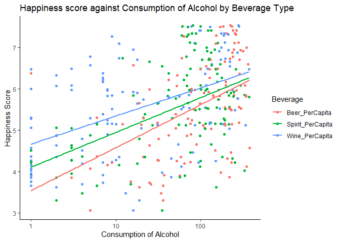

Happiness and Alcohol Consumption
================

``` r
library(dplyr)
```

    ## 
    ## Attaching package: 'dplyr'

    ## The following objects are masked from 'package:stats':
    ## 
    ##     filter, lag

    ## The following objects are masked from 'package:base':
    ## 
    ##     intersect, setdiff, setequal, union

``` r
library(tidyr)
library(ggplot2)
library(caret)
```

    ## Warning: package 'caret' was built under R version 4.0.5

    ## Loading required package: lattice

``` r
library(broom)
library(ggcorrplot)
```

    ## Warning: package 'ggcorrplot' was built under R version 4.0.5

``` r
library(stringr)
```

``` r
data <- read.csv("data/HappinessAlcoholConsumption.csv")
str(data)
```

    ## 'data.frame':    122 obs. of  9 variables:
    ##  $ Country         : chr  "Denmark" "Switzerland" "Iceland" "Norway" ...
    ##  $ Region          : chr  "Western Europe" "Western Europe" "Western Europe" "Western Europe" ...
    ##  $ Hemisphere      : chr  "north" "north" "north" "north" ...
    ##  $ HappinessScore  : num  7.53 7.51 7.5 7.5 7.41 ...
    ##  $ HDI             : int  928 943 933 951 918 922 928 915 938 932 ...
    ##  $ GDP_PerCapita   : num  53.6 79.9 60.5 70.9 43.4 ...
    ##  $ Beer_PerCapita  : int  224 185 233 169 263 240 251 203 261 152 ...
    ##  $ Spirit_PerCapita: int  81 100 61 71 133 122 88 79 72 60 ...
    ##  $ Wine_PerCapita  : int  278 280 78 129 97 100 190 175 212 186 ...

``` r
skimr::skim(data)
```

|                                                  |      |
|:-------------------------------------------------|:-----|
| Name                                             | data |
| Number of rows                                   | 122  |
| Number of columns                                | 9    |
| \_\_\_\_\_\_\_\_\_\_\_\_\_\_\_\_\_\_\_\_\_\_\_   |      |
| Column type frequency:                           |      |
| character                                        | 3    |
| numeric                                          | 6    |
| \_\_\_\_\_\_\_\_\_\_\_\_\_\_\_\_\_\_\_\_\_\_\_\_ |      |
| Group variables                                  | None |

Data summary

**Variable type: character**

| skim\_variable | n\_missing | complete\_rate | min | max | empty | n\_unique | whitespace |
|:---------------|-----------:|---------------:|----:|----:|------:|----------:|-----------:|
| Country        |          0 |              1 |   4 |  22 |     0 |       122 |          0 |
| Region         |          0 |              1 |  12 |  31 |     0 |         9 |          0 |
| Hemisphere     |          0 |              1 |   4 |   5 |     0 |         4 |          0 |

**Variable type: numeric**

| skim\_variable    | n\_missing | complete\_rate |   mean |     sd |     p0 |    p25 |    p50 |    p75 |   p100 | hist  |
|:------------------|-----------:|---------------:|-------:|-------:|-------:|-------:|-------:|-------:|-------:|:------|
| HappinessScore    |          0 |              1 |   5.52 |   1.15 |   3.07 |   4.53 |   5.54 |   6.48 |   7.53 | ▃▆▇▇▆ |
| HDI               |          0 |              1 | 740.88 | 149.85 | 351.00 | 663.75 | 757.50 | 861.50 | 951.00 | ▂▃▃▇▇ |
| GDP\_PerCapita    |          0 |              1 |  91.48 | 209.58 |   1.03 |   4.13 |  12.02 |  41.99 | 953.00 | ▇▁▁▁▁ |
| Beer\_PerCapita   |          0 |              1 | 137.57 | 104.82 |   1.00 |  38.25 | 125.50 | 224.75 | 376.00 | ▇▃▃▃▂ |
| Spirit\_PerCapita |          0 |              1 |  96.60 |  81.44 |   1.00 |  25.50 |  82.50 | 142.50 | 373.00 | ▇▅▂▁▁ |
| Wine\_PerCapita   |          0 |              1 |  66.60 |  88.12 |   1.00 |   5.00 |  16.00 | 112.75 | 370.00 | ▇▂▂▁▁ |

``` r
## Data Transformations
data_longer <- data %>% 
      pivot_longer(c(Beer_PerCapita:Wine_PerCapita), names_to = "Beverage", values_to = "Consumption_PerCapita") 

total_consumption <- data_longer %>%
  group_by(Country) %>%
  mutate(total_consumption = sum(Consumption_PerCapita))
```

## Boxplot of Happiness score against Region

``` r
ggplot(data, aes(x = Region, y = HappinessScore, fill = Region)) +
  geom_boxplot() +
  theme_classic() +
  labs(y = "Happiness Score", title = "Happiness score by Region (Boxplot)") +
  theme(
  legend.position = "none",
  axis.text.x = element_text(angle = 45)
  )
```

<!-- -->

``` r
total_consumption %>%
  ggplot(aes(Region, total_consumption, fill = Region)) +
  geom_boxplot() +
  labs(y = "Total Consumption Per Capita", title = "Total Consumption of Alcohol Per Capita by Region") +
    theme_classic() +
  theme(
  legend.position = "none",
  axis.text.x = element_text(angle = 45)
  )
```

<!-- -->

It is possible for countries and regions to have different cultures
regarding alcohol consumption, as some cultures tend to drink more
alcohol and others tend to drink less or completely abstain from
drinking alcohol. Aside from the cultural difference between regions, a
large impact of the overall will be the wealth, prosperity, health, and
the living conditions of the region variables that are covered or
correlated with the GDP per capita of the region/country as well as the
Human Development Index (HDI).

## Boxplot of Happiness score against Region

``` r
data %>%
  mutate(Hemisphere = str_replace(Hemisphere, "noth", "north")) %>%
ggplot(aes(x = Hemisphere, y = HappinessScore)) +
  geom_boxplot() + 
  labs(x = "Hemisphere", y = "Happiness Score", title = "Happiness score by Hemisphere (Boxplot)") +
  theme_classic() +
  theme(
  legend.position = "none",
  axis.text.x = element_text(angle = 45)
  )
```

<!-- --> In
the analysis, the consideration that there was a difference in happiness
score based on the hemisphere a person lives in was not left out of the
question because there have been significant studies around sunlight and
the hormonal effects on an individual. So it is possible that those who
are on or around the equator (people who tend to have more exposure to
the sun) will be happier than those who are closer to the northern or
southern pole of the Earth. However, based on the box plot presented
above, it shows that there is very little difference in the overall
happiness score of countries based on the hemisphere they reside in.

## Correlation of Data

``` r
corr <- cor(data[,-c(1:3)])
ggcorrplot(corr, hc.order = TRUE, type = "lower",
   lab = TRUE,
   title = "Correlation Plot",
   colors = c("#6D9EC1", "white", "#E46726"))
```

<!-- -->

Surprisingly, GDP per capita has a negative correlation with other
variables such as HDI and Happiness score as common intuition would be
that there is a positive relationship between GDP and HDI. This can be
logically induced as an individual would in general be relatively
happier with a higher wage and everything else remaining constant. A
non-linear relationship should be considered between this variable and
the others as a higher wage may only produce overall marginal effects at
a certain point.

## Relationship between happiness score and Human development index (HDI)

``` r
#Exploring the happiness score against human development index
## Due to possible strong linear correlation with happiness

ggplot(data, aes(HDI, HappinessScore, color = Region)) +
  geom_point() +
  labs(x = "Human Development Index", y = "Happiness Score", title = "Happiness Score against Human Development Index") +
  theme_classic() +
  geom_abline(intercept = coef(lm(HappinessScore ~ HDI, data = data))[1], 
              slope = coef(lm(HappinessScore ~ HDI, data = data))[2],
              color = "lightblue",
              size = 1)
```

<!-- -->

The first variable I chose to explore is HDI due to the fact that it has
the strongest linear correlation with happiness score and should be
included into any machine learning model for this reason. In addition,
visualizing it allows for analysis of different possible patterns and to
view the overall dispersion of the data against a regression.

## Exploring GDP per Capita

``` r
#GDP per capita against Happiness Score
## Exploring GDP against Happiness score due to counter-intuitive results

ggplot(data, aes(GDP_PerCapita, HappinessScore, color = Region))+
  geom_point() +
  theme_classic() +
  labs(x = "GDP Per Capita", y = "Happiness Score", title = "Happiness Score against GDP Per Capita", caption = "*Countries with sub 1k (USD) GDP Per Capita are standardized differently")
```

<!-- -->

``` r
ggplot(data, aes(GDP_PerCapita))+
  geom_histogram(fill = "lightblue") +
  theme_classic()
```

    ## `stat_bin()` using `bins = 30`. Pick better value with `binwidth`.

<!-- -->

Based on the above graphs, an error in addition to a linear
transformation needs to take place to deal with the variable. There is
an interesting thing occurring where a large portion of countries with a
GDP per capita of greater than 250 have some of the lowest happiness
scores. But they do not exceed a GDP of 1000: moreover, the current
country with the lowest GDP per Capita is Zimbabwe at 1.029, thus, I am
lead to the conclusion that there has been an error in the
transformation of this variable and countries with a were not properly
transformed to GDP per Capita in thousands.

### Corrected GDP per Capita

``` r
# Correcting GDP
data <- data %>%
  mutate(GDP_PerCapita = ifelse(GDP_PerCapita > 250, GDP_PerCapita/1000, GDP_PerCapita))

ggplot(data, aes(GDP_PerCapita, HappinessScore, color = Region))+
  geom_point() +
  theme_classic() +
  labs(x = "GDP Per Capita", y = "Happiness Score", title = "Happiness Score against GDP Per Capita")
```

<!-- -->

``` r
ggplot(data, aes(GDP_PerCapita))+
  geom_histogram(fill = "lightblue") +
  theme_classic() + 
  labs(x = "GDP Per Capita (Log Transformation)", y = "Count", title = "Histogram of GDP Per Capita")
```

    ## `stat_bin()` using `bins = 30`. Pick better value with `binwidth`.

<!-- -->

After correcting for this error, it can been seen that there is a
curvilinear relationship between GDP per capita and happiness score,
which is easily address with a log transformation of GDP per capita.
Also, the graph shows more dispersion with countries that have GDP per
capita between 10 and 60.

``` r
# Correcting GDP
data <- data %>%
  mutate(GDP_PerCapita_log = log(GDP_PerCapita))

ggplot(data, aes(GDP_PerCapita_log, HappinessScore, color = Region))+
  geom_point() +
  theme_classic() +
  labs(x = "GDP Per Capita Log Transformation", y = "Happiness Score", title = "Happiness Score against GDP Per Capita (Log Transformation)")
```

<!-- -->

``` r
ggplot(data, aes(GDP_PerCapita_log))+
  geom_histogram(aes(y = ..density..), fill = "lightblue") +
  theme_classic() +
  geom_density() +
  labs(x = "GDP Per Capita", y = "Probability", title = "Histogram of GDP Per Capita")
```

    ## `stat_bin()` using `bins = 30`. Pick better value with `binwidth`.

<!-- -->

``` r
corr2 <- cor(data[,-c(1:3)])
ggcorrplot(corr2, hc.order = TRUE, type = "lower",
           lab = TRUE,
           title = "Correlation Plot",
   colors = c("#6D9EC1", "white", "#E46726"))
```

<!-- -->

In the above graphs, GDP per capita which had a negative correlation
coefficient is now strongly positive with correlated with happiness
score after the correction in the data and the log transformation.

## Exploring Alcohol and Happiness score

``` r
data_longer%>%
ggplot(aes(Consumption_PerCapita, HappinessScore, color = Beverage)) +
  geom_point() +
  scale_x_log10() +
  geom_smooth(method = "lm", se = FALSE) +
  theme_classic() +
  labs(x = "Consumption of Alcohol", y = "Happiness Score", title = "Happiness score against Consumption of Alcohol by Beverage Type")
```

    ## `geom_smooth()` using formula 'y ~ x'

<!-- -->

## Consumption Based on Region

``` r
# linear Regression
mod1 <- lm(HappinessScore ~ Region + GDP_PerCapita_log + HDI + Beer_PerCapita + Spirit_PerCapita + Wine_PerCapita, data = data)
mod2 <- lm(HappinessScore ~ Region + GDP_PerCapita_log + HDI + log(Beer_PerCapita) + log(Spirit_PerCapita) + log(Wine_PerCapita), data = data)
mod3 <- lm(HappinessScore ~ GDP_PerCapita_log + HDI + log(Beer_PerCapita) + log(Spirit_PerCapita) + log(Wine_PerCapita), data = data)
mod4 <- lm(HappinessScore ~ log(Beer_PerCapita) + log(Spirit_PerCapita) + log(Wine_PerCapita), data = data)

mod1 %>% summary()
```

    ## 
    ## Call:
    ## lm(formula = HappinessScore ~ Region + GDP_PerCapita_log + HDI + 
    ##     Beer_PerCapita + Spirit_PerCapita + Wine_PerCapita, data = data)
    ## 
    ## Residuals:
    ##      Min       1Q   Median       3Q      Max 
    ## -1.25167 -0.27011  0.09313  0.29000  1.13335 
    ## 
    ## Coefficients:
    ##                                         Estimate Std. Error t value Pr(>|t|)
    ## (Intercept)                            3.9200562  0.9263000   4.232 4.88e-05
    ## RegionCentral and Eastern Europe      -1.0457205  0.4097760  -2.552  0.01211
    ## RegionEastern Asia                    -1.6022775  0.4819493  -3.325  0.00121
    ## RegionLatin America and Caribbean     -0.3255777  0.4171945  -0.780  0.43686
    ## RegionMiddle East and Northern Africa -1.4532186  0.4412763  -3.293  0.00134
    ## RegionNorth America                   -0.3004279  0.5303623  -0.566  0.57226
    ## RegionSoutheastern Asia               -0.9582950  0.4722794  -2.029  0.04491
    ## RegionSub-Saharan Africa              -1.2311404  0.4667298  -2.638  0.00958
    ## RegionWestern Europe                  -0.4950719  0.3875703  -1.277  0.20421
    ## GDP_PerCapita_log                      0.4180975  0.1255800   3.329  0.00119
    ## HDI                                    0.0027826  0.0013318   2.089  0.03903
    ## Beer_PerCapita                        -0.0009298  0.0006960  -1.336  0.18441
    ## Spirit_PerCapita                      -0.0007029  0.0008220  -0.855  0.39437
    ## Wine_PerCapita                        -0.0025639  0.0009012  -2.845  0.00531
    ##                                          
    ## (Intercept)                           ***
    ## RegionCentral and Eastern Europe      *  
    ## RegionEastern Asia                    ** 
    ## RegionLatin America and Caribbean        
    ## RegionMiddle East and Northern Africa ** 
    ## RegionNorth America                      
    ## RegionSoutheastern Asia               *  
    ## RegionSub-Saharan Africa              ** 
    ## RegionWestern Europe                     
    ## GDP_PerCapita_log                     ** 
    ## HDI                                   *  
    ## Beer_PerCapita                           
    ## Spirit_PerCapita                         
    ## Wine_PerCapita                        ** 
    ## ---
    ## Signif. codes:  0 '***' 0.001 '**' 0.01 '*' 0.05 '.' 0.1 ' ' 1
    ## 
    ## Residual standard error: 0.5211 on 108 degrees of freedom
    ## Multiple R-squared:  0.8163, Adjusted R-squared:  0.7942 
    ## F-statistic: 36.93 on 13 and 108 DF,  p-value: < 2.2e-16

``` r
mod2 %>% summary()
```

    ## 
    ## Call:
    ## lm(formula = HappinessScore ~ Region + GDP_PerCapita_log + HDI + 
    ##     log(Beer_PerCapita) + log(Spirit_PerCapita) + log(Wine_PerCapita), 
    ##     data = data)
    ## 
    ## Residuals:
    ##      Min       1Q   Median       3Q      Max 
    ## -1.17740 -0.23475  0.05143  0.31122  1.19705 
    ## 
    ## Coefficients:
    ##                                        Estimate Std. Error t value Pr(>|t|)    
    ## (Intercept)                            3.606449   0.898709   4.013 0.000111 ***
    ## RegionCentral and Eastern Europe      -0.919859   0.388785  -2.366 0.019765 *  
    ## RegionEastern Asia                    -1.547449   0.452886  -3.417 0.000894 ***
    ## RegionLatin America and Caribbean     -0.312476   0.402404  -0.777 0.439138    
    ## RegionMiddle East and Northern Africa -1.378289   0.414678  -3.324 0.001213 ** 
    ## RegionNorth America                   -0.189325   0.505371  -0.375 0.708674    
    ## RegionSoutheastern Asia               -1.193660   0.466619  -2.558 0.011911 *  
    ## RegionSub-Saharan Africa              -1.190703   0.447630  -2.660 0.009004 ** 
    ## RegionWestern Europe                  -0.487022   0.373607  -1.304 0.195153    
    ## GDP_PerCapita_log                      0.377957   0.119187   3.171 0.001977 ** 
    ## HDI                                    0.003905   0.001389   2.812 0.005852 ** 
    ## log(Beer_PerCapita)                   -0.003014   0.058685  -0.051 0.959129    
    ## log(Spirit_PerCapita)                 -0.069956   0.047132  -1.484 0.140653    
    ## log(Wine_PerCapita)                   -0.193826   0.048247  -4.017 0.000109 ***
    ## ---
    ## Signif. codes:  0 '***' 0.001 '**' 0.01 '*' 0.05 '.' 0.1 ' ' 1
    ## 
    ## Residual standard error: 0.503 on 108 degrees of freedom
    ## Multiple R-squared:  0.8289, Adjusted R-squared:  0.8083 
    ## F-statistic: 40.24 on 13 and 108 DF,  p-value: < 2.2e-16

``` r
mod4 %>% summary()
```

    ## 
    ## Call:
    ## lm(formula = HappinessScore ~ log(Beer_PerCapita) + log(Spirit_PerCapita) + 
    ##     log(Wine_PerCapita), data = data)
    ## 
    ## Residuals:
    ##      Min       1Q   Median       3Q      Max 
    ## -2.08704 -0.55482  0.09851  0.66679  2.01377 
    ## 
    ## Coefficients:
    ##                       Estimate Std. Error t value Pr(>|t|)    
    ## (Intercept)            3.34650    0.31304  10.690  < 2e-16 ***
    ## log(Beer_PerCapita)    0.23187    0.08329   2.784  0.00626 ** 
    ## log(Spirit_PerCapita)  0.21067    0.06267   3.361  0.00105 ** 
    ## log(Wine_PerCapita)    0.11682    0.05792   2.017  0.04596 *  
    ## ---
    ## Signif. codes:  0 '***' 0.001 '**' 0.01 '*' 0.05 '.' 0.1 ' ' 1
    ## 
    ## Residual standard error: 0.9231 on 118 degrees of freedom
    ## Multiple R-squared:  0.3703, Adjusted R-squared:  0.3543 
    ## F-statistic: 23.13 on 3 and 118 DF,  p-value: 7.601e-12

``` r
Models <- tibble(model = c("mod1", "mod2", "mod3"), coeffs = list(tidy(mod1), tidy(mod2), tidy(mod3)), modfit = list(glance(mod1), glance(mod2), glance(mod3)))
```

When looking at the models they appear to have a strong fit, however, it
appears that a lot of the variance captured by GDP and HDI and region
are also in the variables Beer\_perCapita, Spirit\_PerCapita, and
Wine\_PerCapita. The coefficient of variation is 0.0910436, and has a
Residual standard error of 0.503 meaning that on average the model
estimates within 0.503 happiness score, and the overall model has a
coefficient of determination R-squared of 0.8289, meaning that it
explains 82.89% of the variation in the data.

## Conclusion

For this project, I quickly analyzed the data using regression methods,
due to the shape and style of the data, it seemed like a solid model
that would be extraordinarily useful in this situation. The overall
